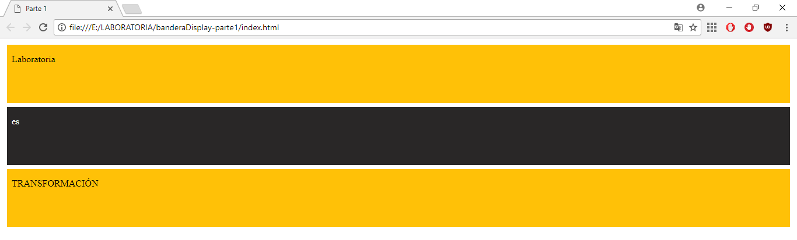

# BANDERAS DISPLAY

## Parte 1

Este proyecto contiene la página web de banderas display

### Objetivo Funcional

Mostrar una bandera con colores amarrillo y negro con texto dentro de cada franja.

### Objetivo Técnico

Practicar los temas de html, css.

### Herramientas utilizadas

* Html5
* CSS

